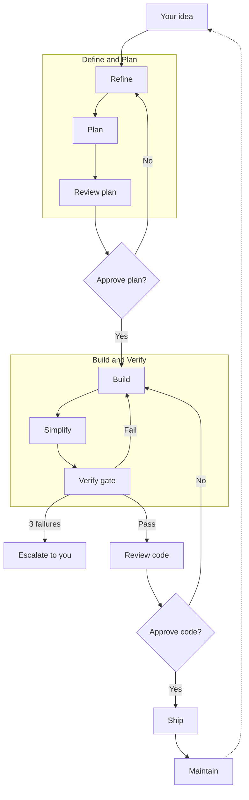

# agent-ops

You make two decisions — approve the plan, approve the code. Everything
else is autonomous: agents refine your idea, plan the work, build it,
verify it passes, and review the code. You stay in control of what
matters. The agents handle the rest.

Zero runtime dependencies. Pure markdown that works wherever your host
tool runs. Designed for Claude Code; usable as system prompts in other
tools. Stack-agnostic — configure your tools in CLAUDE.md.

## What it looks like

### Full pipeline

```
You: @agent-ops add push notification preferences

  [autonomous]
  → Refiner shapes idea → Planner creates plan → Reviewer reviews

You see: plan + verdict
  Verdict: Ready to implement
  Blocking findings: 0
  Non-blocking suggestions: 1
You: go ahead

  [autonomous]
  → Builds → Gate passes → Reviewer reviews code

You see: code + verdict
  Verdict: Ship it
  Blocking findings: 0
  Non-blocking suggestions: 1
You: ship it
```

### Enforcement

```
▶ Running gate...
  ✅ Tests: 142 passed  ❌ Typecheck: 3 errors
  ⏹ FAILED. Fixing. (1 of 3)

▶ Re-running...
  ✅ Tests  ✅ Types  ✅ Lint  ✅ Build
  ✅ Passed. Proceeding to review.
```

3 failures → escalates to you with full context.

### Plan now, build later

```
@agent-ops plan add push notification preferences
  → Refiner → Planner → Reviewer → saved to plans/
  → You review and approve the plan
  → Plan sits in plans/2026-04-06-notification-prefs.md (status: Approved)

  ... days later ...

@agent-ops implement plans/2026-04-06-notification-prefs.md
  → Reads plan → Builds → Gate → Review
  → You approve the code
```

### Maintain: two modes

```
@agent-ops-maintain run weekly checks
  → Runs tools, reads output, compares thresholds
  → 2 critical vulns, coverage below floor, 3 stale PRs

@agent-ops-maintain triage today's errors
  → Investigates: reads stack traces, finds code, correlates deploys
  → Critical: checkout crash since Friday deploy
  → Silence: analytics timeout, third-party noise
```

## How it works

<!-- Flow: Input → Refine → Plan → Review plan → [Approve?] → Build → Simplify → Gate → [Pass?] → Review code → [Approve?] → Ship → Maintain → loops back -->


## Standalone agents

Use `@agent-ops` for the full pipeline. Use standalone agents when
you want just one phase:

| Agent | Use when | Example |
|-------|----------|---------|
| `@agent-ops-refiner` | Exploring an idea before committing to a plan | `think through this API redesign` |
| `@agent-ops-planner` | You already know what to build, need a structured plan | `plan the migration` |
| `@agent-ops-reviewer` | You have code ready and want an independent review | `review my PR, be brutal` |
| `@agent-ops-maintain` | Running health checks or triaging production errors | `triage errors` |

## Install

### Prerequisites

- [Claude Code](https://claude.ai/download) CLI or desktop app
- A project with a CLAUDE.md file (the agents read it for configuration)

### Quick start

```bash
# 1. Install the plugin
claude plugin marketplace add https://github.com/epzee/agent-ops
claude plugin install agent-ops

# 2. Add agent-ops sections to your project's CLAUDE.md
#    Copy from templates/CLAUDE-md-sections.md — sets thresholds,
#    maintenance commands, and monitoring config

# 3. Create a plans directory
mkdir plans

# 4. Verify it works (health-reports/ is created automatically on first run)
@agent-ops-maintain run weekly checks
```

See [setup guide](docs/SETUP.md) for project configuration details.

### Other tools

Use the markdown body of any agent file as a system prompt.
The autonomous pipeline requires subagent support. Independent
reviewer context requires isolated subagent sessions.

## Repo structure

```
agents/              5 agents — coordinator + 4 phase specialists
skills/              5 skills — gate, review criteria, plan format,
                     maintenance checks, refiner roles
workflows/           4 workflows — feature, plan-only, add-tests, template
maintenance/         25 maintenance tasks organized by category:
  code-health/         complexity, dead code, TODOs, deps, bundle size
  security/            vulns, secrets, licenses, OWASP surface
  testing/             coverage, flaky tests, missing tests, lint drift
  production/          errors, perf, stale PRs, deploy frequency
  ai-docs/             CLAUDE.md freshness, skills, prompt drift, ecosystem
  documentation/       README, API docs, changelog gaps
templates/           CLAUDE.md sections to add to your project
docs/                setup, customizing, scheduled tasks, philosophy
```

## Skill discovery

Agents discover and load relevant skills at runtime from
.claude/skills/, installed plugins, and skill packs.

### Works great with

**[agent-skills](https://github.com/addyosmani/agent-skills)** —
engineering skills for Define → Ship. Agents discover and use
these automatically. Recommended but not required — the pipeline
works standalone.

## Design

- **Markdown, not runtime.** No dependencies, no build step, no lock-in.
  Works wherever your host tool runs. Uninstall by deleting.
- **State in conversation.** Plans and reports are written to disk. The
  pipeline sequence (which phase is next, retry count) lives in
  conversation context — closing the conversation stops the pipeline.
  Resume by referencing the saved plan or report.
- **Claude Code-first.** The full autonomous pipeline needs subagent
  support. Independent review needs isolated contexts. In single-context
  tools, the reviewer shares the builder's thread.
- **Commands in CLAUDE.md.** The framework defines what to check;
  your project defines how. No hardcoded tool names.

## Docs

- [Setup](docs/SETUP.md) | [Customizing](docs/CUSTOMIZING.md)
- [Scheduled tasks](docs/SCHEDULED-TASKS.md) | [Philosophy](docs/PHILOSOPHY.md)

## Resources

- [Building effective agents](https://www.anthropic.com/engineering/building-effective-agents)
- [Effective context engineering for AI agents](https://www.anthropic.com/engineering/effective-context-engineering-for-ai-agents)
- [Effective harnesses for long-running agents](https://www.anthropic.com/engineering/effective-harnesses-for-long-running-agents)
- [Agent skills best practices](https://platform.claude.com/docs/en/agents-and-tools/agent-skills/best-practices)
- [The complete guide to building skills for Claude](https://resources.anthropic.com/hubfs/The-Complete-Guide-to-Building-Skill-for-Claude.pdf)
- [agent-skills](https://github.com/addyosmani/agent-skills) — engineering skills for Define → Ship

## License
MIT
