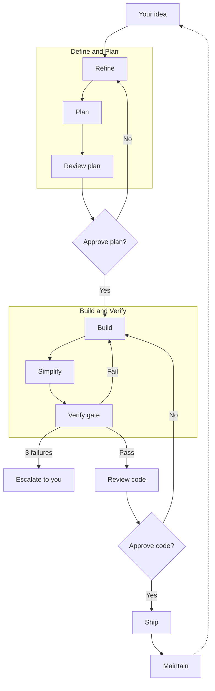
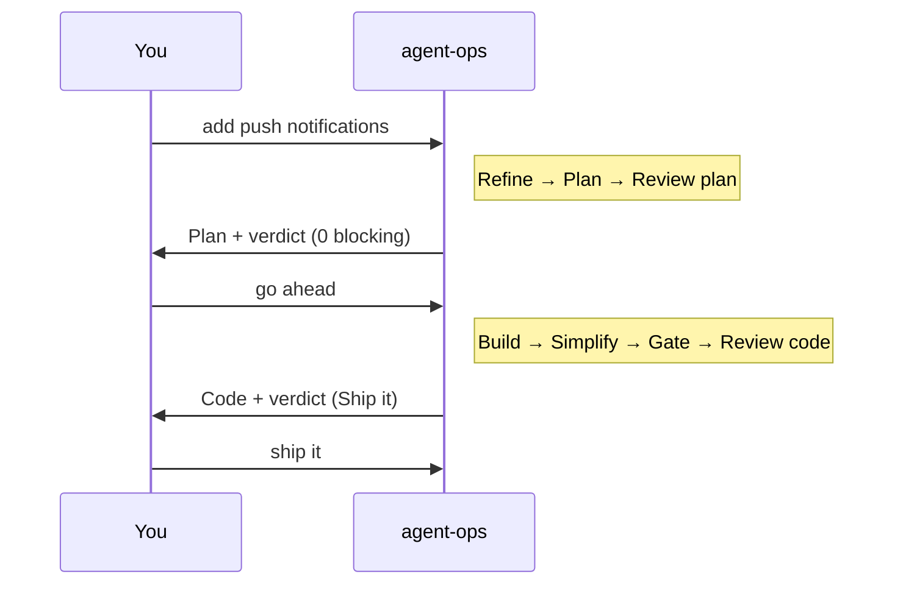
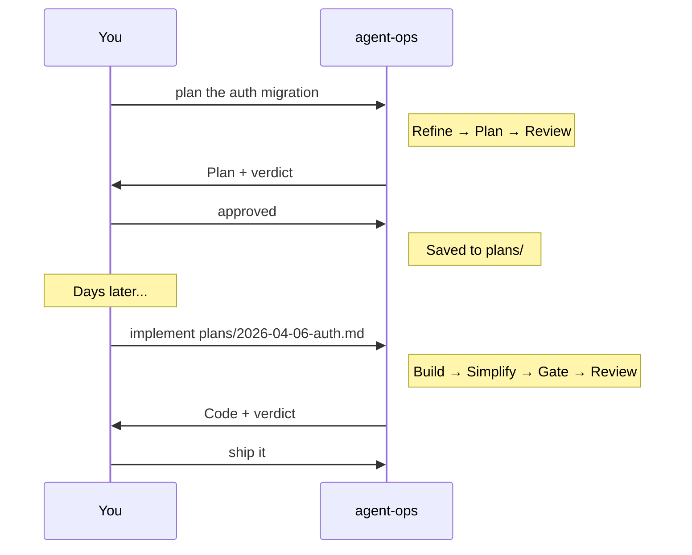

# agent-ops

Autonomous software engineering pipeline for Claude Code. Agents
refine, plan, build, verify, and review your code — you make two
decisions: approve the plan and approve the code.

Zero runtime dependencies. Pure markdown that works wherever your
host tool runs. Stack-agnostic — configure your tools in CLAUDE.md.

## Usage

| I want to... | Run |
|--------------|-----|
| Build a feature end-to-end | `@agent-ops add push notifications` |
| Plan now, build later | `@agent-ops plan the auth migration` |
| Implement an approved plan | `@agent-ops implement plans/2026-04-06-auth.md` |
| Explore or refine an idea | `@agent-ops-refiner think through the API redesign` |
| Review code independently | `@agent-ops-reviewer review my PR, be brutal` |
| Run health checks | `@agent-ops-maintain run weekly checks` |
| Triage production errors | `@agent-ops-maintain triage errors` |

## Install

### Prerequisites

- [Claude Code](https://claude.ai/download) CLI or desktop app
- A project with a CLAUDE.md file (the agents read it for configuration)

### Quick start

```bash
# 1. Install the plugin
claude plugin marketplace add https://github.com/epzee/agent-ops
claude plugin install agent-ops

# 2. Add agent-ops sections to your project's CLAUDE.md
#    (copy from templates/CLAUDE-md-sections.md)

# 3. Verify it works
@agent-ops-refiner what does this project do
```

See [setup guide](docs/SETUP.md) for project configuration details.

### Other tools

Use the markdown body of any agent file as a system prompt.
The autonomous pipeline requires subagent support. Independent
reviewer context requires isolated subagent sessions.

## How it works

<!-- Flow: Input → Refine → Plan → Review plan → [Approve?] → Build → Simplify → Gate → [Pass?] → Review code → [Approve?] → Ship → Maintain → loops back -->


## What it looks like

### Full pipeline



### Plan now, build later



### Enforcement

```
▶ Running gate...
  ✅ Tests: 142 passed  ❌ Typecheck: 3 errors
  ⏹ FAILED. Fixing. (1 of 3)

▶ Re-running...
  ✅ Tests  ✅ Types  ✅ Lint  ✅ Build
  ✅ Passed. Proceeding to review.
```

3 failures → escalates to you with full context.

## Repo structure

```
├── agents/          5 agents — coordinator + 4 specialists
├── skills/          5 skills — gate, review, plan format, maintenance, roles
├── workflows/       4 workflows — feature, plan-only, add-tests, template
├── maintenance/     26 tasks by category
│   ├── code-health/   complexity, dead code, TODOs, deps, bundle
│   ├── security/      vulns, secrets, licenses, OWASP
│   ├── testing/       coverage, flaky, missing, lint drift
│   ├── production/    errors, perf, stale PRs, deploys
│   ├── ai-docs/       CLAUDE.md, skills, prompts, best practices, ecosystem
│   └── documentation/ README, API docs, changelog
├── templates/       CLAUDE.md sections for your project
└── docs/            setup, customizing, scheduled tasks, philosophy
```

## Skill discovery

Agents discover and load relevant skills at runtime from
.claude/skills/, installed plugins, and skill packs.

### Works great with

**[agent-skills](https://github.com/addyosmani/agent-skills)** —
engineering skills for Define → Ship. Agents discover and use
these automatically. Recommended but not required — the pipeline
works standalone.

## Design

- **Markdown, not runtime.** No dependencies, no build step, no lock-in.
  Works wherever your host tool runs. Uninstall by deleting.
- **State in conversation.** Plans and reports are written to disk. The
  pipeline sequence (which phase is next, retry count) lives in
  conversation context — closing the conversation stops the pipeline.
  Resume by referencing the saved plan or report.
- **Claude Code-first.** The full autonomous pipeline needs subagent
  support. Independent review needs isolated contexts. In single-context
  tools, the reviewer shares the builder's thread.
- **Commands in CLAUDE.md.** The framework defines what to check;
  your project defines how. No hardcoded tool names.

## Docs

- [Setup](docs/SETUP.md) | [Customizing](docs/CUSTOMIZING.md)
- [Scheduled tasks](docs/SCHEDULED-TASKS.md) | [Philosophy](docs/PHILOSOPHY.md)

## Resources

- [Building effective agents](https://www.anthropic.com/engineering/building-effective-agents)
- [Effective context engineering for AI agents](https://www.anthropic.com/engineering/effective-context-engineering-for-ai-agents)
- [Effective harnesses for long-running agents](https://www.anthropic.com/engineering/effective-harnesses-for-long-running-agents)
- [Agent skills best practices](https://platform.claude.com/docs/en/agents-and-tools/agent-skills/best-practices)
- [The complete guide to building skills for Claude](https://resources.anthropic.com/hubfs/The-Complete-Guide-to-Building-Skill-for-Claude.pdf)
- [agent-skills](https://github.com/addyosmani/agent-skills) — engineering skills for Define → Ship

## License
MIT
