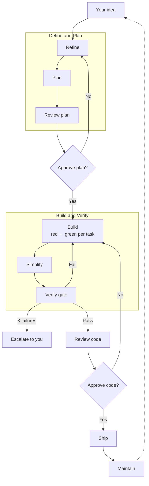
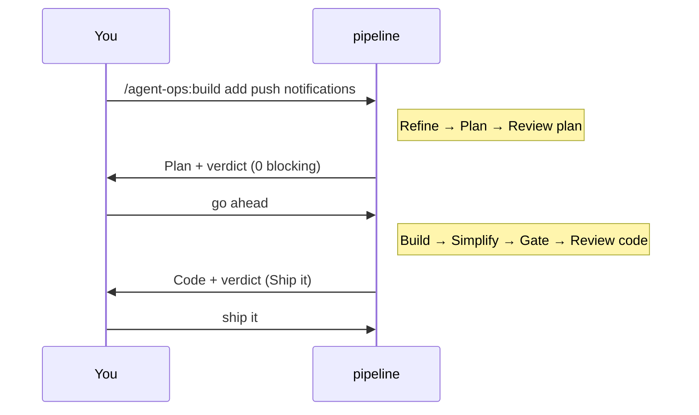
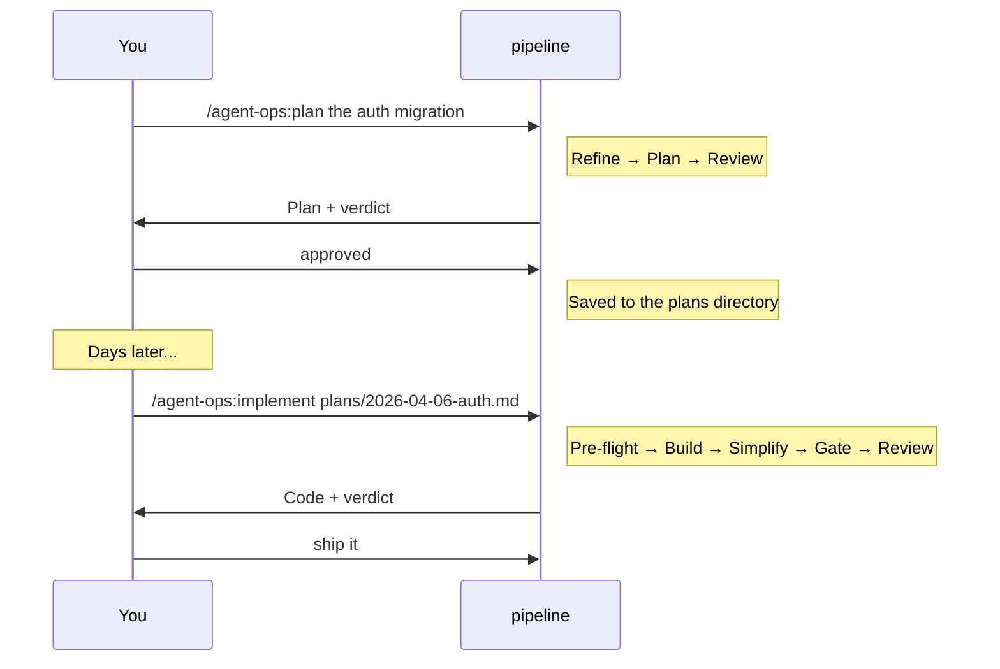

# agent-ops

Autonomous software engineering pipeline for Claude Code. The pipeline
refines, plans, builds, verifies, and reviews your code — you make two
decisions: approve the plan and approve the code.

Zero runtime dependencies. Pure markdown plus two declarative hooks.
Stack-agnostic — configure your tools in CLAUDE.md.

## Usage

| I want to... | Run |
|--------------|-----|
| Build a feature end-to-end | `/agent-ops:build add push notifications` |
| Fix a bug with a reproducer test | `/agent-ops:build fix [bug description]` |
| Plan now, build later | `/agent-ops:plan the auth migration` |
| Implement an approved plan | `/agent-ops:implement plans/2026-04-06-auth.md` |
| Explore or refine an idea | `/agent-ops:refine think through the API redesign` |
| Review code independently | `/agent-ops:review my PR, be brutal` |
| Run the verification gate | `/agent-ops:verification-gate` |
| Run health checks | `/agent-ops:maintain run weekly checks` |
| Triage production errors | `/agent-ops:maintain triage errors` |

## Install

### Prerequisites

- [Claude Code](https://code.claude.com) CLI or desktop app
- A project with a CLAUDE.md file (the pipeline reads it for configuration)

### Quick start

```bash
# 1. Install the plugin
claude plugin marketplace add https://github.com/epzee/agent-ops
claude plugin install agent-ops

# 2. Add agent-ops sections to your project's CLAUDE.md
#    (copy from templates/CLAUDE-md-sections.md)

# 3. Verify it works
/agent-ops:refine what does this project do
```

See [setup guide](docs/SETUP.md) for project configuration details.

### Other tools

Use the markdown body of any skill or agent file as a system prompt.
The autonomous pipeline requires subagent support; independent review
requires isolated subagent sessions; hook enforcement requires
Claude Code.

## How agent-ops works

Entry-point commands drive one enforced pipeline in your main
conversation. Two agents exist for the two jobs that need isolated
contexts: independent review and maintenance runs.

```
┌─────────────────────────────────────────────────────┐
│  /agent-ops:build · :plan · :implement              │
│  (pipeline skill — runs in your conversation)       │
│                                                     │
│  Refine (fork) → Plan (fork) → Build → Simplify     │
│                → Gate → Review (isolated agent)     │
│                                                     │
│  Red-green       → failing test first, per task     │
│  Gate (enforced) → tests · typecheck · lint · build │
│  Stop hook       → can't end turn on a failing gate │
│  Circuit breaker → 3 fails → escalate with context  │
│  Decision points → 2 human approvals (plan, code)   │
└─────────────────────────────────────────────────────┘
```

**Key design choices:**

- **Gates are enforced, not advised.** The pipeline runs four commands
  from your CLAUDE.md, and a Stop hook blocks ending the turn on an
  unpassed gate. "Override" is the only escape hatch and it stamps the
  artifact so every downstream reviewer knows.
- **Red-green by default.** Build tasks write a failing test first,
  confirm it fails for the right reason, then implement. Carve-outs
  (UI polish, config, migrations, docs) are explicit.
- **Reviewers run in isolated contexts.** Independent review is a
  structural fix for anchoring bias, not a process preference. The
  reviewer is an agent precisely so it never sees the builder's
  reasoning.
- **Only humans approve.** Two decisions (plan, code) — and only a
  human moves a plan to Approved. The pipeline refuses to execute
  plans in any other state than Approved or In Progress.

<details>
<summary><b>Pipeline flow diagram</b></summary>


```mermaid
graph TD
    Input[Your idea]

    subgraph auto1 ["Define and Plan"]
        Refine[Refine] --> Plan[Plan] --> ReviewPlan[Review plan]
    end

    Input --> Refine
    ReviewPlan --> ApprovePlan{Approve plan?}
    ApprovePlan -->|No| Refine
    ApprovePlan -->|Yes| Build

    subgraph auto2 ["Build and Verify"]
        Build[Build<br/>red → green per task] --> Simplify[Simplify] --> Gate[Verify gate]
    end

    Gate -->|Fail| Build
    Gate -->|3 failures| Escalate[Escalate to you]
    Gate -->|Pass| ReviewCode[Review code]
    ReviewCode --> ApproveCode{Approve code?}
    ApproveCode -->|No| Build
    ApproveCode -->|Yes| Ship[Ship]

    Ship --> Maintain[Maintain]
    Maintain -.-> Input
```

</details>

<details>
<summary><b>Example runs</b></summary>

**Full pipeline**


```mermaid
sequenceDiagram
    You->>pipeline: /agent-ops:build add push notifications
    Note right of pipeline: Refine → Plan → Review plan
    pipeline->>You: Plan + verdict (0 blocking)
    You->>pipeline: go ahead
    Note right of pipeline: Build → Simplify → Gate → Review code
    pipeline->>You: Code + verdict (Ship it)
    You->>pipeline: ship it
```

**Plan now, build later**


```mermaid
sequenceDiagram
    You->>pipeline: /agent-ops:plan the auth migration
    Note right of pipeline: Refine → Plan → Review
    pipeline->>You: Plan + verdict
    You->>pipeline: approved
    Note right of pipeline: Saved to the plans directory
    Note over You: Days later...
    You->>pipeline: /agent-ops:implement plans/2026-04-06-auth.md
    Note right of pipeline: Pre-flight → Build → Simplify → Gate → Review
    pipeline->>You: Code + verdict
    You->>pipeline: ship it
```

</details>

## Commands

| Command | What it does |
|---------|--------------|
| `/agent-ops:build` | Full pipeline: Define → Plan → Build → Verify → Review |
| `/agent-ops:plan` | Plan only — saves an approved plan for later |
| `/agent-ops:implement` | Pre-flight checks, then build an Approved/In Progress plan |
| `/agent-ops:refine` | Shape a rough idea into a precise prompt (forked context) |
| `/agent-ops:review` | Spawn the isolated reviewer on a plan, diff, or tests |
| `/agent-ops:verification-gate` | Run the four gate checks from CLAUDE.md |
| `/agent-ops:test-first` | The red-green loop, runnable standalone |
| `/agent-ops:maintain` | Health checks by cadence, single checks, or error triage |

## Agents

Two agents — kept only because their jobs need isolated contexts.
Everything else is a skill.

| Agent | Role | Why an agent |
|-------|------|--------------|
| [agent-ops-reviewer](agents/agent-ops-reviewer.md) | Independent reviews of plans, code, or tests | Must never see the builder's reasoning (anchoring bias) |
| [agent-ops-maintain](agents/agent-ops-maintain.md) | Hygiene checks and production error triage | Heavy tool output, no human interaction, runs scheduled |

## Skills

Internal skills carry the contracts; agents and commands reference
them instead of restating them.

| Phase | Skill | What It Does |
|-------|-------|--------------|
| All | [pipeline](skills/pipeline/SKILL.md) | The enforced pipeline: modes, pre-flight, steps, non-negotiables |
| Define | [refiner-roles](skills/refiner-roles/SKILL.md) | Engineering role perspectives for shaping ideas |
| Plan | [planner](skills/planner/SKILL.md) | Investigated task breakdowns with runnable verification |
| Plan | [plan-format](skills/plan-format/SKILL.md) | Plan template: tasks, verification, scope, status lifecycle |
| Build | [test-first](skills/test-first/SKILL.md) | Red-green loop: failing test first, honest red, then green |
| Verify | [verification-gate](skills/verification-gate/SKILL.md) | Four enforced checks + the override/stamp protocol |
| Review | [review-criteria](skills/review-criteria/SKILL.md) | Review routing, intensity levels, verdict contract |
| Maintain | [maintenance-checks](skills/maintenance-checks/SKILL.md) | Dispatches scheduled maintenance tasks and error triage |

Installed plugin and project skills are discovered automatically at
runtime and used alongside these — see
[Works great with](#works-great-with).

## Enforcement

```
▶ Running gate...
  ✅ Tests: 142 passed  ❌ Typecheck: 3 errors
  ⏹ FAILED. Fixing. (1 of 3)

▶ Re-running...
  ✅ Tests  ✅ Types  ✅ Lint  ✅ Build
  ✅ Passed. Proceeding to review.
```

3 failures → escalates to you with full context. A Stop hook blocks
ending the turn on a failing gate, and a SubagentStop hook holds the
reviewer to its verdict contract — see [hooks](docs/HOOKS.md).

## Repo structure

```
├── skills/          8 commands + internal skills (pipeline, contracts)
├── agents/          2 agents — reviewer + maintainer (isolation cases)
├── hooks/           Stop gate enforcement, reviewer contract check
├── maintenance/     26 tasks by category
│   ├── code-health/   complexity, dead code, TODOs, deps, bundle
│   ├── security/      vulns, secrets, licenses, OWASP
│   ├── testing/       coverage, flaky, missing, lint drift
│   ├── production/    errors, perf, stale PRs, deploys
│   ├── ai-docs/       CLAUDE.md, skills, prompts, best practices, ecosystem
│   └── documentation/ README, API docs, changelog
├── templates/       CLAUDE.md sections for your project
└── docs/            setup, customizing, hooks, scheduled tasks, workflows, philosophy
```

## Works great with

**[agent-skills](https://github.com/addyosmani/agent-skills)** —
engineering skills for Define → Ship. The pipeline discovers and uses
these automatically at runtime, alongside any other installed plugin
skills. Recommended but not required — the pipeline works standalone.

## Design

- **Markdown, not runtime.** No dependencies, no build step, no lock-in.
  Uninstall by deleting. The only non-markdown piece is a declarative
  hooks.json.
- **State on disk.** Plans and reports are files; plan status and the
  Progress Log survive across sessions. The in-flight pipeline sequence
  lives in conversation context — resume by pointing
  `/agent-ops:implement` at the saved plan.
- **Claude Code-first.** The full pipeline needs skills, subagents, and
  hooks. In single-context tools, the reviewer shares the builder's
  thread — agent-ops is honest about that limitation.
- **Commands in CLAUDE.md.** The framework defines what to check;
  your project defines how. No hardcoded tool names.
- **Native-feature friendly.** Plan mode, `/code-review`, and verify-
  style skills overlap parts of this pipeline; agent-ops adds the
  enforced sequence, persistent plan files, and maintenance layer.
  See [philosophy](docs/PHILOSOPHY.md).

## Docs

- [Setup](docs/SETUP.md) | [Customizing](docs/CUSTOMIZING.md) | [Hooks](docs/HOOKS.md)
- [Scheduled tasks](docs/SCHEDULED-TASKS.md) | [Workflows](docs/workflows/) | [Philosophy](docs/PHILOSOPHY.md)

## Resources

- [Building effective agents](https://www.anthropic.com/engineering/building-effective-agents)
- [Effective context engineering for AI agents](https://www.anthropic.com/engineering/effective-context-engineering-for-ai-agents)
- [Effective harnesses for long-running agents](https://www.anthropic.com/engineering/effective-harnesses-for-long-running-agents)
- [Agent skills best practices](https://platform.claude.com/docs/en/agents-and-tools/agent-skills/best-practices)
- [The complete guide to building skills for Claude](https://resources.anthropic.com/hubfs/The-Complete-Guide-to-Building-Skill-for-Claude.pdf)
- [agent-skills](https://github.com/addyosmani/agent-skills) — engineering skills for Define → Ship

## License
MIT
