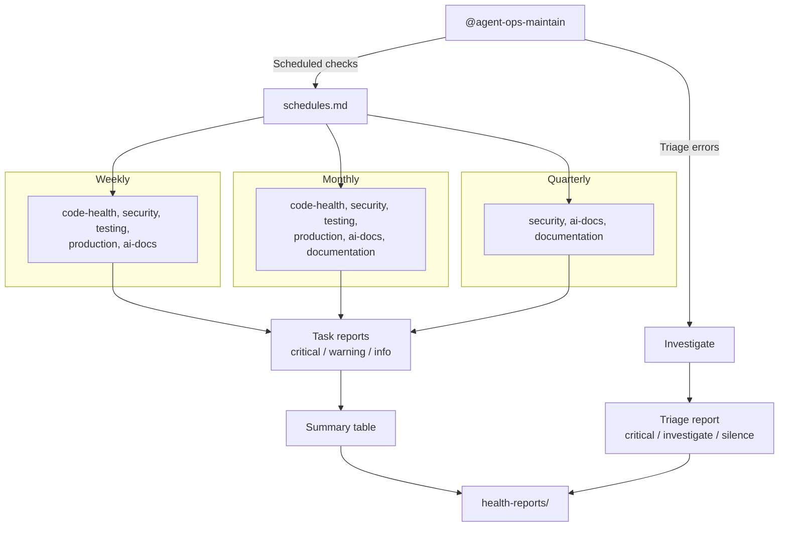

# Maintenance tasks

Scheduled hygiene checks for @agent-ops-maintain. Each file in this
directory is a prompt that the maintenance agent executes against a
target project.

<!-- Flow: @agent-ops-maintain → schedules.md → weekly/monthly/quarterly tasks → task reports (critical/warning/info) → summary table; or triage errors → triage report → health-reports/ -->


## Philosophy

CI catches what breaks. Maintenance catches what rots.

These tasks detect slow-moving problems that no single commit
introduces: dependencies falling behind, coverage drifting down,
documentation going stale, AI context files diverging from reality.
They run on a cadence, not on every push.

**Operator, not analyst.** Tasks run tools and read output. They
don't parse source code to estimate quality — they use real scanners,
real test runners, real package managers. When a tool isn't available,
skip and note it.

**Stack-agnostic by default.** Each task reads `CLAUDE.md` and
`package.json` (or equivalent) to detect the stack and adapt. No
task assumes a specific framework, CI system, or error tracker.

**Structured output.** Every task produces a report with severity
levels (`critical` / `warning` / `info`), file/line references where
applicable, and a recommended action per finding.

## Directory structure

```
maintenance/
├── README.md              ← you are here
├── schedules.md           ← cadence map with rationale
├── code-health/           ← complexity, dead code, deps, bundle size
├── security/              ← vulns, secrets, licenses, OWASP
├── testing/               ← coverage, flaky tests, lint drift
├── production/            ← errors, perf, stale PRs, deploy frequency
├── ai-docs/               ← CLAUDE.md, skills, prompt drift, best practices
└── documentation/         ← README, API docs, changelog
```

## How to run

### Claude Code scheduled tasks (recommended, human-initiated)

Set up recurring remote agents via `/schedule` or the Claude Code
desktop app. Each runs in its own session against a target project.

Cadence-based runs use `schedules.md` to determine which tasks to execute:

```
@agent-ops-maintain run weekly checks
@agent-ops-maintain run monthly checks
@agent-ops-maintain run quarterly checks
```

Or run a single task by path:

```
@agent-ops-maintain run maintenance/code-health/dependency-freshness.md
```

### CLI /loop for in-session use

Run a check on a recurring interval during an active session:

```
/loop 30m @agent-ops-maintain run maintenance/testing/coverage-trend.md
```

Useful during long refactors or migration work where you want
continuous feedback.

### Ad-hoc

Run any task directly:

```
@agent-ops-maintain run maintenance/security/secret-scan.md
```

## Adding new tasks

1. Create a markdown file in the appropriate category directory
2. Add YAML frontmatter with `name` and `description`
3. Keep task files under ~2,000 tokens (~60–80 lines). This leaves
   the agent's context budget for actual work — reading files, running
   tools, and producing the report. If a task needs more instruction
   than this, split reference material into a supporting file in the
   same directory that the agent reads on demand.
4. Add the task to `schedules.md` with a cadence and rationale
5. Follow the report format: severity → finding → file/line → action

## Disabling tasks

Comment out lines in `schedules.md` to skip tasks you don't need yet.
The agent reads `schedules.md` to determine what to run for a given
cadence — commented tasks are skipped.
